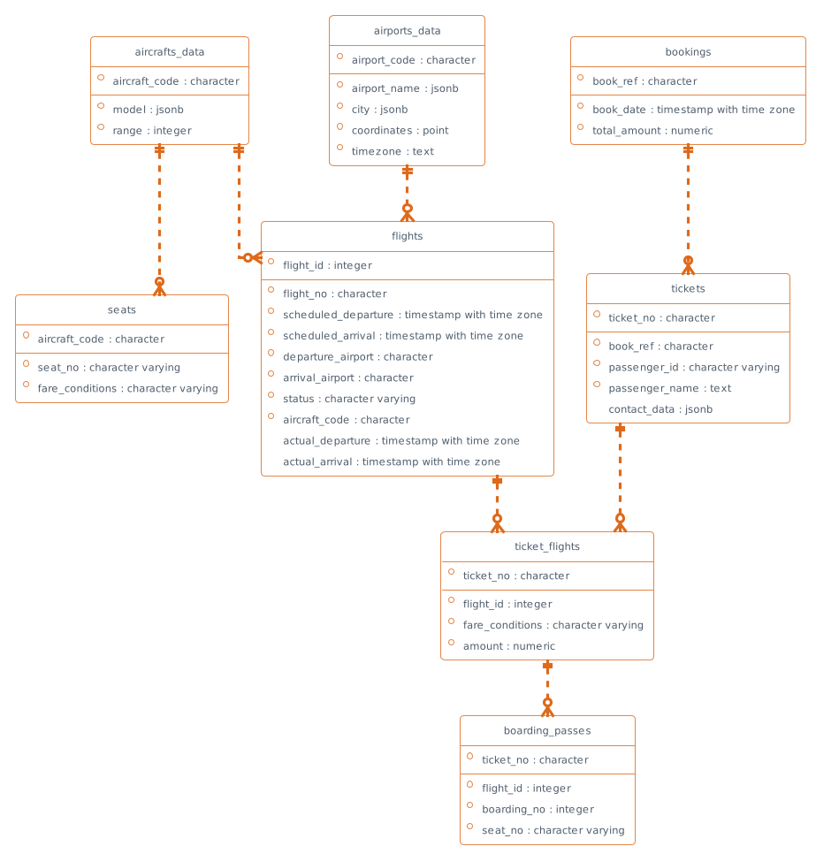

# Chagall

Chagall is a dramatically simple Python-script with a bunch of predefined SQL-scripts and Jinja2 templates for turning your data into something beautiful (docs, charts, diagrams, configurations etc.)


## How it works

The idea is very simple - we take some SQL-queries and call them from a Jinja2 template.

For example, let's write a simple query to get all working employees - `get_working_employees.sql`:

```sql
select name
     , position
     , experience
  from employee
 where is_fired = false
   and in_vacation = false
```

Now let's write a simple template for introducing our employees in Markdown format - `our_employees.md.j2`:

```jinja



    This is **{{ emp.name }}**, our valued employee working as a *{{ emp.position }}* in our company for ***{{ emp.experience }}*** years.

```

Run `Chagall`:
```console
python chagall.py our_employees.md.j2 our_employees.md
```

And we will get a file `our_employees.md` with this contents:
> This is **Jhon Doe**, our valued employee working as a *manager* in our company for ***10*** years.

Of course, in real-life cases, we can use the full power of SQL and all the features of Jinja2.

## Motivation

Foremost, to demonstrate the power of SQL.

**SQL** is the de facto standard for data manipulation for most databases and storage systems.

**Jinja2** is a very powerful and familiar template engine for most data people.

If we combine them together, we can do great things.

For example, we can take two simple SQL-scripts ([table_columns.sql](sql/table_columns.sql) and [table_relationships.sql](sql/table_relationships.sql)), pass them through PlantUML template ([diagram.plantuml.j2](templates/er_diagram/diagram.plantuml.j2)) and get ER-diagram for your DB of our own taste and without any tricky third-party tools:



## How to run it

Init and activate virtual env (optional):
```
virtualenv .venv
source .venv/bin/activate
```

Install dependencies:
```
pip3 install -r requirements.txt
```

Run:
```
python chagall.py -h
```

## SQL scripts conventions

- Use Python-style naming for parameters: `%(schema_name)s`, `%(max_table_count)s`
- Keep to [axis](https://gramin.pro/posts/rivers-and-axis) when formatting


## Explore examples

### Generate documentation

```
python chagall.py templates/tables_doc/tables.html.j2 docs/examples/tables_doc/tables.html
python chagall.py templates/tables_doc/tables.adoc.j2 docs/examples/tables_doc/tables.adoc
```

### Generate charts

```
python chagall.py templates/big_tables/quickchart.html.j2 docs/examples/big_tables/quickchart.html
python chagall.py templates/big_tables/chartjs.html.j2 docs/examples/big_tables/chartjs.html
```

### Generate diagrams

```
python chagall.py templates/er_diagram/mermaid.md.j2 docs/examples/er_diagram/mermaid.md
python chagall.py templates/er_diagram/diagram.plantuml.j2 docs/examples/er_diagram/diagram.plantuml
```


## Recomended VS Code plugins

- [Better Jinja](https://marketplace.visualstudio.com/items?itemName=samuelcolvin.jinjahtml) - Syntax highlighting for jinja(2) including HTML, SQL, JSON, Markdown and other templates.
