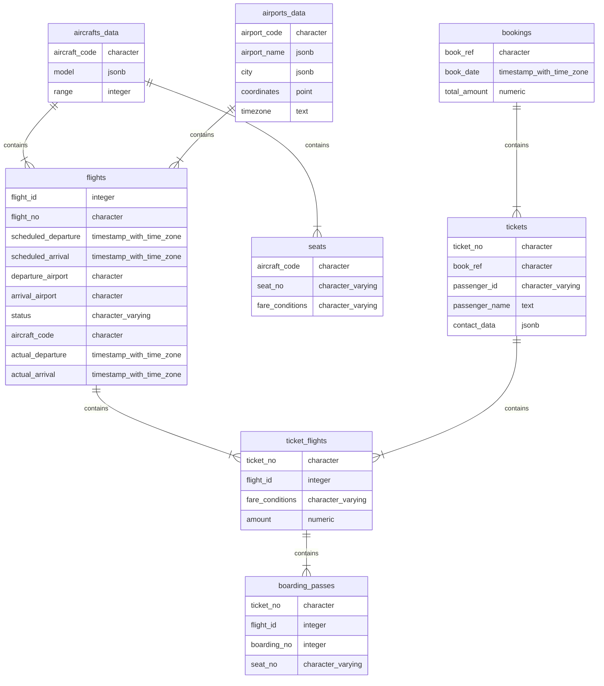

```mermaid
    erDiagram
        
            aircrafts_data {
                
                aircraft_code character
                
                model jsonb
                
                range integer
                
            }
        
            airports_data {
                
                airport_code character
                
                airport_name jsonb
                
                city jsonb
                
                coordinates point
                
                timezone text
                
            }
        
            boarding_passes {
                
                ticket_no character
                
                flight_id integer
                
                boarding_no integer
                
                seat_no character_varying
                
            }
        
            bookings {
                
                book_ref character
                
                book_date timestamp_with_time_zone
                
                total_amount numeric
                
            }
        
            flights {
                
                flight_id integer
                
                flight_no character
                
                scheduled_departure timestamp_with_time_zone
                
                scheduled_arrival timestamp_with_time_zone
                
                departure_airport character
                
                arrival_airport character
                
                status character_varying
                
                aircraft_code character
                
                actual_departure timestamp_with_time_zone
                
                actual_arrival timestamp_with_time_zone
                
            }
        
            seats {
                
                aircraft_code character
                
                seat_no character_varying
                
                fare_conditions character_varying
                
            }
        
            ticket_flights {
                
                ticket_no character
                
                flight_id integer
                
                fare_conditions character_varying
                
                amount numeric
                
            }
        
            tickets {
                
                ticket_no character
                
                book_ref character
                
                passenger_id character_varying
                
                passenger_name text
                
                contact_data jsonb
                
            }
        
                
        
            aircrafts_data ||--|{ flights : contains
        
            aircrafts_data ||--|{ seats : contains
        
            airports_data ||--|{ flights : contains
        
            bookings ||--|{ tickets : contains
        
            flights ||--|{ ticket_flights : contains
        
            ticket_flights ||--|{ boarding_passes : contains
        
            tickets ||--|{ ticket_flights : contains
        
```